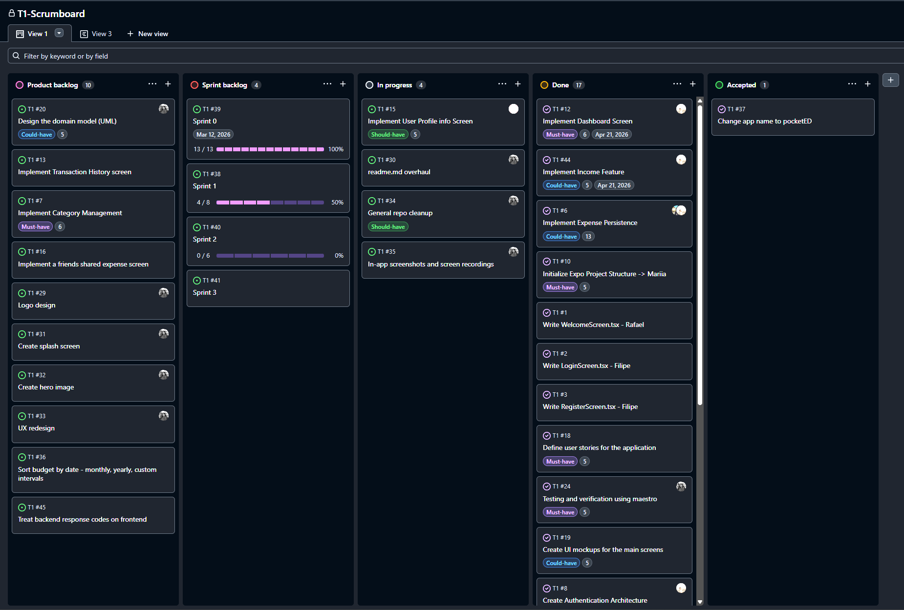

<!-- Template file for README.md for LEIC-ES-2025-26

> [!NOTE] In this file, you will find the structure you should follow to document your mobile app in the README.md file for LEIC-ES-2025-26. It is a single file with guidelines, as comments, only seen in Edit mode, not in Preview mode. You can add more sections, but for assessment reasons and automation, please make sure to include all sections of this template. Your professors will clarify about specificities of your app. -->

# pocketED Development Report

> **Note:** A lot of commits to this repository have been made through pair programming and keyboard-sharing by all 4 group members during practical classes as per Extreme Programming methodology. For this reason, the number of commits made by a single person does not accurately represent the entire participation of all members during the development cycle.

Welcome to the documentation of _pocketED_!

This Software Development Report, tailored for LEIC-ES-2025-26, provides comprehensive details about _pocketED_, starting from a high-level vision and going into low-level implementation decisions.

It is organised by the following activities:

- [pocketED Development Report](#pocketed-development-report)
  - [Business Modelling](#business-modelling)
  - [SDG Alignment](#sdg-alignment)
    - [Goal 4 – Quality Education](#goal-4--quality-education)
    - [Goal 12 – Responsible Consumption](#goal-12--responsible-consumption)
  - [Product Vision](#product-vision)
    - [Features and Assumptions](#features-and-assumptions)
  - [Requirements](#requirements)
    - [User Stories](#user-stories)
    - [Domain model](#domain-model)
    - [User Interfaces](#user-interfaces)
      - [Welcome Screen](#welcome-screen)
      - [Login Screen](#login-screen)
      - [Registration Screen](#registration-screen)
      - [Dashboard Screen](#dashboard-screen)
      - [Transaction Management](#transaction-management)
    - [Domain Concepts](#domain-concepts)
  - [Architecture and Design](#architecture-and-design)
    - [Logical architecture](#logical-architecture)
    - [Physical architecture](#physical-architecture)
    - [Functional prototype](#functional-prototype)
  - [Testing Strategy](#testing-strategy)
  - [Project management](#project-management)
    - [Sprint 0 - All systems go.](#sprint-0---all-systems-go)
    - [Sprint 1 - Spring cleaning!](#sprint-1---spring-cleaning)

Contributions are to be made exclusively by the initial team, but we may open them to the community, after the course, in all areas and topics: requirements, technologies, development, experimentation, testing, etc.

Please contact us!

Thank you!

- **Filipe Camacho** - up202208040@up.pt
- **João Gusmão** - up201406255@up.pt
- **Mariia Hutsul** - up202310202@up.pt
- **Rafael Hartilek Issa** - up202300428@up.pt

---

## Business Modelling

## SDG Alignment

### Goal 4 – Quality Education

Supporting financial literacy as a lifelong learning competence.

### Goal 12 – Responsible Consumption

## Product Vision

_pocketED_ empowers students to achieve financial independence through intuitive expense tracking and smart budget management, fostering responsible consumption habits.

<!--
Start by defining a clear and concise product vision for your app, to help members of the team, contributors, and users into focusing their often disparate views into a concise, visual, and short textual form.

The vision should provide a "high concept" of the product for marketers, developers, and managers.

A product vision describes the essential of the product and sets the direction to where a product is headed, and what the product will deliver in the future.

**We favor a catchy and concise statement, ideally one sentence.**

We suggest you use the product vision template described in the following link:
* [How To Create A Convincing Product Vision To Guide Your Team, by uxstudioteam.com](https://uxstudioteam.com/ux-blog/product-vision/)

To learn more about how to write a good product vision, please read:
* [Vision, by scrumbook.org](http://scrumbook.org/value-stream/vision.html)
* [Product Management: Product Vision, by ProductPlan](https://www.productplan.com/glossary/product-vision/)
* [20 Inspiring Vision Statement Examples (2019 Updated), by lifehack.org](https://www.lifehack.org/articles/work/20-sample-vision-statement-for-the-new-startup.html)
-->

### Features and Assumptions

**Main Features:**

- **Income & Expense Tracking:** Users can manually record money coming in (scholarships, allowance) and money going out.
- **Budget Definition:** Set a monthly spending limit to monitor financial health.
- **Expense Categorization:** Assign transactions to categories (Food, Transport, etc.) for better analysis.
- **Real-time Balance:** Instant calculation of available funds based on total incomes and expenses.
- **Financial Statistics:** Visual summary of spending patterns over time.

**Assumptions:**

- Users will manually input their transactions as there is no direct bank API integration in this version.
- The application is primarily designed for individual use on a single mobile device.
- Data persistence is handled locally on the device for the current prototype.

<!--
Indicate an  initial/tentative list of high-level features - high-level capabilities or desired services of the system that are necessary to deliver benefits to the users.
 - Feature XPTO - a few words to briefly describe the feature
 - Feature ABCD - ...
...

Optionally, indicate an initial/tentative list of assumptions that you are doing about the app and dependencies of the app to other systems.
-->

## Requirements

### User Stories

<!--
In this section you should describe all kinds of requirements for your module: functional and non-functional requirements.

For LEIC-ES-2025-26, the requirements will be gathered and documented as user stories.

Please add in this section a concise summary of all the user stories (not each user story!).

**User stories as GitHub Project Items**
The user stories themselves should be created and described as items in your GitHub Project with the label "user story".

A user story is a description of a desired functionality told from the perspective of the user or customer. A starting template for the description of a user story is *As a < user role >, I want < goal > so that < reason >.*

Name the item with either the full user story or a shorter name (recommended). In the “comments” field, add relevant notes, mockup images, and acceptance test scenarios, linking to the acceptance tests when available, and finally estimate value and effort.

**INVEST in good user stories**.
You may add more details after, but the shorter and complete, the better. In order to decide if the user story is good, please follow the [INVEST guidelines](https://xp123.com/articles/invest-in-good-stories-and-smart-tasks/).

**User interface mockups**.
After the user story text, you should add a draft of the corresponding user interfaces, a simple mockup or draft, if applicable.

**Acceptance tests**.
For each user story you should write also the acceptance tests (textually in [Gherkin](https://cucumber.io/docs/gherkin/reference/)), i.e., a description of scenarios (situations) that will help to confirm that the system satisfies the requirements addressed by the user story.

**Value and effort**.
At the end, it is good to add a rough indication of the value of the user story to the customers (e.g. [MoSCoW](https://en.wikipedia.org/wiki/MoSCoW_method) method) and the team should add an estimation of the effort to implement it using points in a kind-of-a Fibonnacci scale (1,2,3,5,8,13,20,40, no idea).

-->

The requirements of pocketED are expressed as user stories that describe the main functionalities from the perspective of the user. These stories are managed through the project GitHub board.

The main user stories identified for the system include:

- **Set Monthly Budget**  
  As a student, I want to define how much money I have available to spend so that I can control my expenses and avoid overspending.

- **Add Expense Record**  
  As a student, I want to record my expenses by category and amount so that I can track where my money is being spent.

- **Add Income Record**  
  As a student, I want to record income that I receive (for example from parents, scholarships, or freelance work) so that I can track all money entering my wallet.

- **Categorize Expenses**  
  As a student, I want to categorize my expenses so that I can better understand my spending habits.

- **View Remaining Balance**  
  As a student, I want to see my remaining balance so that I know how much money I can still spend.

- **View Financial Statistics**  
  As a student, I want to visualize summaries of my income and expenses so that I can better understand my financial behavior.

Each user story includes acceptance scenarios and mockups that are managed in the project backlog using GitHub Projects.

### Domain model

***Under construction**. [Refer to the existing Mermaid UML diagrams file here](resources/uml/pocketed-mermaid-uml.md)*

### User Interfaces

The pocketED mobile application provides a simple and intuitive interface designed for students who want to track their personal finances.
The main screens of the application are described below.

#### Welcome Screen

The welcome screen is the entry point of the application. It introduces the purpose of pocketED and provides navigation to authentication options.

**Main interface elements:**

- Application title and description
- Button to log in
- Button to register a new account

#### Login Screen

The login screen allows existing users to authenticate and access their personal wallet.

**Main interface elements:**

- Email input field
- Password input field
- Login button
- Navigation link to registration

#### Registration Screen

The registration screen allows new users to create an account in the system.

**Main interface elements:**

- Username input
- Email input
- Password input
- Register button

#### Dashboard Screen

The dashboard is the main screen where users can view their financial overview.

**Main interface elements:**

- Current balance
- List of recent transactions
- Budget overview
- Access to add income or expense

#### Transaction Management

Users can add financial transactions to track their spending and income.

**Main interface elements:**

- Amount input field
- Category selector (for expenses)
- Description field
- Save transaction button

### Domain Concepts

- **User** – Represents a student using the application. Each user has a username and email and owns a personal wallet.

- **Wallet** – Represents the financial container of the user. It stores the total balance and the monthly spending limit defined by the user.

- **Transaction** – Represents a financial operation recorded in the wallet. Each transaction includes an amount, date, and description.

- **Income** – A specialized type of transaction that represents money received by the user (for example scholarships, allowances, or part-time salary).

- **Expense** – A specialized type of transaction representing money spent by the user. Each expense is associated with a category.

- **Category** – Represents a classification used to group expenses (for example Food, Transport, Entertainment).

- **Statistics** – Represents calculated financial summaries such as total income and total expenses based on recorded transactions.

<!--
To better understand the context of the software system, it is useful to have a simple UML class diagram with all and only the key concepts (names, attributes) and relationships involved of the problem domain addressed by your app.
Also provide a short textual description of each concept (domain class).

Example:
 <p align="center" justify="center">
  
</p>
-->

## Architecture and Design

<!--
The architecture of a software system encompasses the set of key decisions about its organization.

A well written architecture document is brief and reduces the amount of time it takes new programmers to a project to understand the code to feel able to make modifications and enhancements.

To document the architecture requires describing the decomposition of the system in their parts (high-level components) and the key behaviors and collaborations between them.

In this section you should start by briefly describing the components of the project and their interrelations. You should describe how you solved typical problems you may have encountered, pointing to well-known architectural and design patterns, if applicable.
-->

pocketED is currently implemented as a cross-platform mobile application in [`mobile-app`](https://github.com/LEIC-ES-2025-26-2LEIC12/T1/tree/main/mobile-app). The project follows a simple layered architecture: routing is handled through Expo Router in `app/`, while the domain-specific code lives in `src/`, grouped into screens, context, services, models, theme, and local data. This separation keeps navigation concerns independent from application logic and makes later backend integration easier.

The current technology stack is:

- `React Native` for the UI layer.
- `Expo SDK 54` for the runtime, bundling, and developer tooling.
- `Expo Router` for file-based navigation.
- `TypeScript` with strict mode enabled.
- `React Context` and `useReducer` for shared authentication state.
- `React Navigation` theming primitives under the router layer.
- Local JSON data for prototype persistence.

### Logical architecture

<!--
The purpose of this subsection is to document the high-level logical structure of the code (Logical View), using a UML diagram with logical packages, without the worry of allocating to components, processes or machines.

It can be beneficial to present the system in a horizontal decomposition, defining layers and implementation concepts, such as the user interface, business logic and concepts.

Example of _UML package diagram_ showing a _logical view_ of the Eletronic Ticketing System (to be accompanied by a short description of each package):


-->

***Under construction**. [Refer to the existing Mermaid UML diagrams file here](resources/uml/pocketed-mermaid-uml.md)*


### Physical architecture

<!--
The goal of this subsection is to document the high-level physical structure of the software system (machines, connections, software components installed, and their dependencies) using UML deployment diagrams (Deployment View) or component diagrams (Implementation View), separate or integrated, showing the physical structure of the system.

It should describe also the technologies considered and justify the selections made. Examples of technologies relevant for ESOF are, for example, frameworks for mobile applications (such as Flutter).

Example of _UML deployment diagram_ showing a _deployment view_ of the Eletronic Ticketing System (please notice that, instead of software components, one should represent their physical/executable manifestations for deployment, called artifacts in UML; the diagram should be accompanied by a short description of each node and artifact):


-->

At the current stage, the physical architecture is a single-client prototype:

- A development machine runs Node.js, npm, and the Expo toolchain.
- The Expo development server bundles the application and serves it during development.
- The client application runs on Android, iOS, or web through the Expo runtime.
- Application assets and `src/data/expenses.json` are bundled locally with the app.

There is no backend server or external database yet. Authentication is stored in memory via React Context, and expense records are loaded from a static JSON file. This keeps the system easy to run while the product is still validating its core flows.

### Functional prototype

<!--
To help on validating all the architectural, design and technological decisions made, we usually implement a functional prototype, a thin vertical slice of the system integrating as much technologies as we can.

In this subsection please describe which feature, or part of it, you have implemented, and how, together with a snapshot of the user interface, if applicable.

At this phase, instead of a complete user story, you can simply implement a small part of a feature that demonstrates thay you can use the technology, for example, show a screen with the app credits (name and authors).
-->

The current functional prototype validates the selected architecture through a thin end-to-end flow:

- A welcome screen introduces the product and links to login and registration routes.
- Dedicated login and registration screens demonstrate reusable screen composition and navigation.
- The root layout injects `AuthProvider`, proving that shared state can be provided across the routing tree.
- The home tab checks authentication state and redirects unauthenticated users to the welcome flow.
- The dashboard reads mock expense entries through a service layer and renders a basic monthly total.

This prototype already demonstrates the viability of the chosen stack for navigation, state sharing, typed models, theming, and local data access.

## Testing Strategy

The target test pyramid for pocketED is:

- **Unit tests** for reducers, service functions, validation helpers, financial calculations, formatting helpers, and small extracted business rules.
- **Mobile component tests** for screen behavior with React Native Testing Library, mocked navigation, mocked services, and mocked storage.
- **Acceptance tests with Maestro** for the main user stories on Android: authentication navigation, register/login, add income, add expense, set budget, categorize expenses, view remaining balance, view statistics, profile, logout, and session behavior.

Current testing status:

- The mobile app has a Jest/Expo test harness with React Native Testing Library, AsyncStorage mocks, fetch mocks, and test-only API configuration.
- The automated mobile suite contains **14 Jest test files** covering auth context/reducer behavior, API service behavior, dashboard utility calculations, and all main mobile screens — **120 tests, all passing**.
- Maestro acceptance flows are complete in `mobile-app/.maestro`: 9 numbered flows covering every user story plus a reusable `setup/seed_user.yaml` subflow. All flows use stable `testID` selectors and euro currency formatting.
- CI runs lint, typecheck, and the full Jest suite with coverage on every push to `main` and `tests`.
- The mobile API base URL is centralized in `mobile-app/src/services/api.ts`; Jest defaults it to `http://localhost/api` so automated tests do not target the shared public API.
- Backend testing is intentionally deferred.

Baseline commands:

```bash
cd mobile-app

# Lint and type-check
npm run lint
npm run typecheck

# Unit and component tests (with coverage)
npm test
npm run test:coverage

# Maestro acceptance suite (requires connected Android device/emulator)
maestro test .maestro

# From WSL with Windows ADB
./scripts/maestro-wsl.sh .maestro
./scripts/maestro-wsl.sh .maestro/01_auth_register_login.yaml
```

## Project management

<!--
Software project management is the art and science of planning and leading software projects, in which they are planned, implemented, monitored and controlled.

In the context of ESOF, we recommend each team to adopt a set of project management practices and tools capable of registering tasks, assigning tasks to team members, adding estimations to tasks, monitor tasks progress, and therefore being able to track their projects.

Common practices of managing agile software development with Scrum are: backlog management, release management, estimation, Sprint planning, Sprint development, acceptance tests, and Sprint retrospectives.

You can find below information and references related with the project management:

* Backlog management: Product backlog and Sprint backlog in a [Github Projects board](https://github.com/orgs/FEUP-LEIC-ES-2023-24/projects/64);
* Release management: [v0](#), v1, v2, v3, ...;
* Sprint planning and retrospectives:
  * plans: screenshots of Github Projects board at begin and end of each Sprint;
  * retrospectives: meeting notes in a document in the repository, addressing the following questions:
    * Did well: things we did well and should continue;
    * Do differently: things we should do differently and how;
    * Puzzles: things we don’t know yet if they are right or wrong;
    * list of a few improvements to implement next Sprint;

-->

### Sprint 0 - All systems go.

Sprint 0 was about getting to know eachother, laying down the product vision and getting the project up and running. After agreeing on the theme, we then settled on the tech stack that was better suited to us as a team and our goals. At this point the development was very much iterative, we did a lot of pair programming and a lot of things were put in and scrapped back altogether. We implemented the first and second versions of the app's UI and the general UX prototype.

**Sprint goals:**

- Define the project vision and main features
- Create the initial product backlog
- Set up the GitHub repository
- Configure the development environment
- Initialize the Expo React Native project

**Main activities:**

- Creation of the GitHub repository and project board
- Definition of initial user stories
- Setup of the Expo development environment
- Initial architecture discussion and technology selection

**Tools used:**

- GitHub for version control
- GitHub Projects for backlog management
- Expo CLI for project initialization
- Visual Studio Code as the development environment
- Maestro for verification and validation

**Outcome:**

- A working development environment
- A defined product vision
- An initial backlog of user stories
- A configured GitHub repository and project board
- Verification and testing


### Sprint 1 - Spring cleaning!

Sprint 0 was productive but messy, and we cleaned up most of it during this spring. Just in time for the stereotypical spring cleaning! There were a lot of changes under the hood, and while most of them were not necessarily either visible or flashy, they were defo very much needed. From bugfixes to general QoL improvements, we revised our work process and better redistributed the workload between eachother, focusing on our individual strengths.



#### Increment Scope

The following features were delivered during Sprint 1:

- **Backend API** — implemented a C# ASP.NET Core backend with local SQLite persistence, exposing endpoints for users, expenses, and budgets.
- **User Authentication** — functional login, registration, and logout flows connected end-to-end between the mobile app and the backend.
- **Add Expense** — users can record a new expense with amount, category, and description.
- **Add Income** — users can record income entries that update their running balance.
- **Add Budget** — users can define a monthly spending limit which is reflected on the dashboard.
- **Local persistence** — transaction and budget data is persisted across sessions via the backend database.

#### Sprint Review

This release marks the first genuinely usable prototype of pocketED. For the first time users can create an account, log in, and actively record their financial activity — expenses, income, and a monthly budget — and see it reflected in real time on the dashboard. This is the foundation of the financial tracking experience we intend to deliver, and it adds real, demonstrable value to end-users.

#### Sprint Retrospective

**Did well:**
- Code implementation quality improved significantly over Sprint 0 — the codebase is cleaner, better structured, and more consistent.
- Team collaboration and workload distribution worked well, with members contributing according to their individual strengths.

**Do differently:**
- Testing was done entirely through manual verification by team members. No automated Maestro tests were written or executed, despite the tooling being set up. Next sprint we should write at least one Maestro flow per user story delivered.

**Puzzles:**
- We are still unsure about the right level of test coverage for a prototype at this stage, and how to balance automated testing effort against feature delivery speed.


<!--
### Sprint 2

### Sprint 3

### Sprint 4

### Final Release
-->
