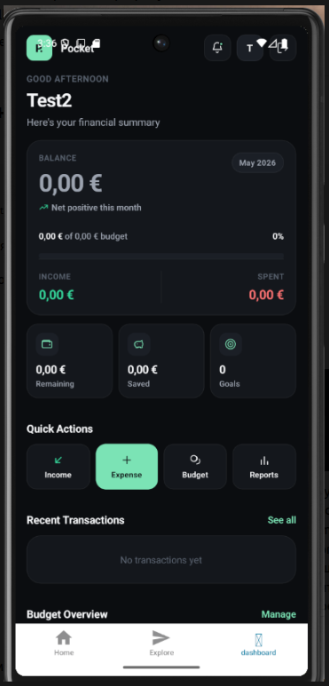
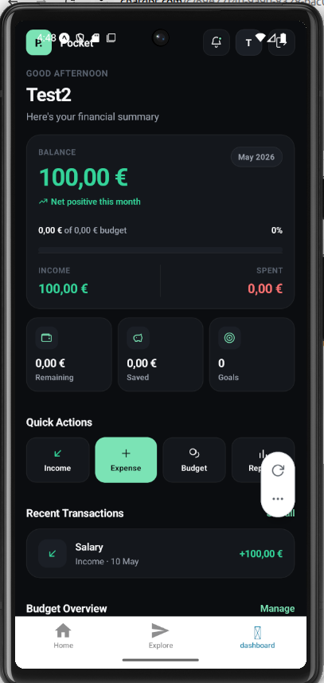
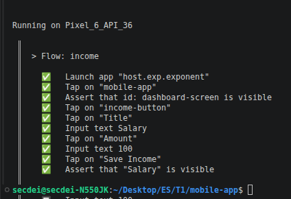

# pocketED – Development Report
 
> **Note:** Many commits in this repo were made through pair programming and keyboard-sharing during practical classes, following Extreme Programming practices. Commit counts per person don't reflect actual individual contribution.
 
This is the software development report for _pocketED_. It covers the project from high-level vision down to implementation decisions, organised as follows:
 
- [Business Modelling](#business-modelling)
- [SDG Alignment](#sdg-alignment)
- [Product Vision](#product-vision)
- [Requirements](#requirements)
- [Architecture and Design](#architecture-and-design)
- [Testing Strategy](#testing-strategy)
- [Project Management](#project-management)


Some, not all, (but defo more than none) rights reserved - **Filipe Camacho** (up202208040@up.pt), **João Gusmão** (up201406255@up.pt), **Mariia Hutsul** (up202310202@up.pt), **Rafael Hartilek Issa** (up202300428@up.pt) - Engenharia de Software at FEUP, 2026. 

---
 
## Business Modelling
 
## SDG Alignment
 
### Goal 4 – Quality Education
 
pocketED supports financial literacy as a practical, everyday skill - the kind that doesn't get taught in classrooms but matters a lot once students are living independently.
 
### Goal 12 – Responsible Consumption
 
By giving students visibility into where their money goes, the app encourages more deliberate spending habits.
 
---
 
## Product Vision
 
_pocketED_ is a personal finance app built for students. It helps them track expenses, set budgets, and get a clearer picture of their money - without the complexity of tools designed for people with more complicated finances.
 
### Features and Assumptions
 
**Core features:**
 
- **Income & expense tracking** – Record money in (scholarships, allowances, part-time work) and money out, manually entered by the user.
- **Monthly budget** – Set a spending limit and track progress against it.
- **Expense categories** – Assign expenses to categories like Food or Transport to see where the money actually goes.
- **Live balance** – The current balance updates as transactions are added.
- **Spending statistics** – A visual summary of income and expenses over time.
**Assumptions:**
 
- There is no bank API integration; users enter transactions themselves.
- The app is designed for a single user on a single device.
- Data is stored locally on the device in the current prototype.
---
 
## Requirements
 
### User Stories
 
Requirements are tracked as user stories in the GitHub project board. The main ones are:
 
- **Set monthly budget** – As a student, I want to set a spending limit so I can avoid going over budget.
- **Add expense** – As a student, I want to record what I spend, with a category and amount, so I can track where my money is going.
- **Add income** – As a student, I want to log money I receive so I have an accurate picture of what I have available.
- **Categorise expenses** – As a student, I want to group my expenses by category so I can spot patterns in my spending.
- **View remaining balance** – As a student, I want to see how much I have left so I know whether I can still spend.
- **View financial statistics** – As a student, I want a visual summary of my income and expenses so I can review my financial behaviour over time.
Each user story has acceptance scenarios and UI mockups managed through the GitHub project board.
 
### Domain Model
 
_Under construction._ [See the Mermaid UML diagrams here](resources/uml/pocketed-mermaid-uml.md).
 
### User Interfaces
 
The app is designed to be straightforward - a few focused screens rather than a cluttered interface.
 
#### Welcome Screen
 
The entry point. Shows what the app is for and offers buttons to log in or register.
 
#### Login Screen
 
- Email and password fields
- Login button
- Link to registration
#### Registration Screen
 
- Username, email, and password fields
- Register button
#### Dashboard Screen
 
The main screen. Shows current balance, recent transactions, budget status, and buttons to add income or an expense.
 
#### Transaction Management
 
A simple form for adding a transaction: amount, category (for expenses), description, and a save button.
 
### Domain Concepts
 
- **User** – A student using the app. Has a username, email, and an associated wallet.
- **Wallet** – Holds the user's balance and their monthly spending limit.
- **Transaction** – A single financial entry: an amount, date, and description.
- **Income** – A transaction representing money received (scholarship, allowance, freelance work, etc.).
- **Expense** – A transaction representing money spent, tagged with a category.
- **Category** – A label used to group expenses (Food, Transport, Entertainment, etc.).
- **Statistics** – Calculated summaries of income and expenses based on recorded transactions.
---
 
## Architecture and Design
 
pocketED is a cross-platform mobile app built with React Native and Expo, living in the [`mobile-app`](https://github.com/LEIC-ES-2025-26-2LEIC12/T1/tree/main/mobile-app) directory.
 
The structure follows a simple layered approach: Expo Router handles navigation in `app/`, and everything domain-specific sits in `src/` - screens, context, services, models, theme, and local data. Keeping navigation separate from application logic makes the codebase easier to follow and leaves room for backend integration later.
 
**Stack:**
 
- `React Native` – UI layer
- `Expo SDK 54` – runtime, bundling, developer tooling
- `Expo Router` – file-based navigation
- `TypeScript` (strict mode)
- `React Context` + `useReducer` – shared auth state
- `React Navigation` theming primitives
- Local JSON for prototype data persistence
### Logical Architecture
 
_Under construction._ [See the Mermaid UML diagrams here](resources/uml/pocketed-mermaid-uml.md).
 
### Physical Architecture
 
Right now the system is a single-client prototype:
 
- A development machine runs Node.js, npm, and the Expo toolchain.
- The Expo dev server bundles and serves the app during development.
- The client runs on Android, iOS, or web via the Expo runtime.
- App assets and `src/data/expenses.json` are bundled locally.
There's no backend or external database yet. Authentication lives in memory through React Context, and expense records come from a static JSON file. This keeps things simple while the core flows are still being validated.
 
### Functional Prototype
 
The current prototype demonstrates the full architecture through a basic end-to-end flow:
 
- A welcome screen introduces the app and links to login and registration.
- Login and registration screens show reusable screen composition and navigation patterns.
- The root layout injects `AuthProvider`, confirming shared state works across the routing tree.
- The home tab checks auth state and redirects unauthenticated users to the welcome flow.
- The dashboard reads mock expense entries through a service layer and shows a basic monthly total.
This is enough to confirm the stack works for navigation, state sharing, typed models, theming, and local data access.
 
---
 
## Testing Strategy
 
The target test structure:
 
- **Unit tests** – Reducers, service functions, validation helpers, financial calculations, formatting utilities.
- **Component tests** – Screen behaviour with React Native Testing Library, using mocked navigation, services, and storage.
- **Acceptance tests (Maestro)** – End-to-end flows on Android covering the main user stories: auth, register/login, add income, add expense, set budget, categorise expenses, view balance, view statistics, profile, logout, and session behaviour.
**Current status:**
 
- The mobile app has a Jest/Expo harness with React Native Testing Library, AsyncStorage mocks, fetch mocks, and test-only API config.
- **14 Jest test files, 120 tests, all passing** - covering auth context/reducer, API service behaviour, dashboard calculations, and all main screens.
- Maestro flows are in `mobile-app/.maestro`: 9 numbered flows covering every user story plus a reusable `setup/seed_user.yaml` subflow. All flows use stable `testID` selectors and euro formatting.
- CI runs lint, typecheck, and the full Jest suite on every push to `main` and `tests`.
- The API base URL is set in `mobile-app/src/services/api.ts` and defaults to `http://localhost/api` in tests, so automated tests don't hit the shared public API.
- Backend testing is deferred for now.
**Commands:**
 
```bash
cd mobile-app
 
# Lint and type-check
npm run lint
npm run typecheck
 
# Unit and component tests (with coverage)
npm test
npm run test:coverage
 
# Maestro acceptance suite (requires connected Android device/emulator)
maestro test .maestro
 
# From WSL with Windows ADB
./scripts/maestro-wsl.sh .maestro
./scripts/maestro-wsl.sh .maestro/01_auth_register_login.yaml
```
 
---
 
## Project Management
 
### Sprint 0 – All systems go
 
Sprint 0 was about getting organised: agreeing on the product idea, picking a tech stack that suited the team, and getting the project off the ground. Development in this phase was exploratory - lots of pair programming, things going in and being ripped out. We went through two versions of the UI and built the initial UX prototype.
 
**Goals:**
- Define the product vision and core features
- Set up the GitHub repo and project board
- Configure the development environment
- Initialise the Expo React Native project
- Draft the initial user stories
**Tools used:** GitHub, GitHub Projects, Expo CLI, VS Code, Maestro
 
**Outcome:** A working dev environment, a defined product vision, an initial backlog, and a configured repo.
 
---
 
### Sprint 1 – Spring cleaning
 
Sprint 0 left things a bit rough, and Sprint 1 was mostly about cleaning that up - hence the name. Most of the changes weren't visible to a user but were overdue: bug fixes, quality-of-life improvements, and a better distribution of work across the team based on where each person is strongest.
 

 
#### Increment Scope
 
Delivered in Sprint 1:
 
- **Backend API** – C# ASP.NET Core backend with local SQLite persistence, exposing endpoints for users, expenses, and budgets.
- **User authentication** – Login, registration, and logout connected end-to-end between the mobile app and the backend.
- **Add expense** – Users can record an expense with amount, category, and description.
- **Add income** – Users can record income entries that update their balance.
- **Set budget** – Users can define a monthly spending limit, reflected on the dashboard.
- **Data persistence** – Transactions and budget data persist across sessions via the backend database.
#### Sprint Review
 
This is the first version of pocketED that's genuinely usable. Users can create an account, log in, and record financial activity - expenses, income, and a monthly budget - and see it reflected on the dashboard in real time. It's the foundation the rest of the app will be built on.
 
#### Sprint Retrospective
 
**Went well:**
- Code quality improved noticeably compared to Sprint 0 - the codebase is cleaner and more consistent.
- Team collaboration worked better, with members contributing where they're strongest.
**Do differently:**
- Automated test coverage is still limited. The first Maestro flow (Add Income) was implemented and validated this sprint. Future sprints should expand coverage to other user stories and edge cases.
**Open questions:**
- We're still figuring out the right level of test coverage for a prototype at this stage, and how to balance testing effort with feature delivery.
#### Maestro End-to-End Testing
 
As part of Sprint 1 validation, we set up automated mobile UI testing with Maestro.
 
The flow validates the full Add Income journey:
 
1. Open the app
2. Navigate to the dashboard
3. Open the Add Income screen
4. Enter a title and amount
5. Save the transaction
6. Verify it appears in Recent Transactions
##### Flow
 
```yaml
appId: host.exp.exponent
---
- launchApp
- tapOn: "mobile-app"
- assertVisible:
    id: "dashboard-screen"
- tapOn: "income-button"
- tapOn: "Title"
- inputText: "Salary"
- tapOn: "Amount"
- inputText: "100"
- tapOn: "Save Income"
- assertVisible: "Salary"
```
 
##### Running the test
 
```bash
maestro test .maestro/flows/income.yaml
```
 
##### Screenshots
 
<table>
  <tr>
    <td align="center" valign="bottom">
      <br>
      Dashboard (before)
    </td>
    <td align="center" valign="bottom">
      <br>
      Income added
    </td>
    <td align="center" valign="bottom">
      <br>
      Maestro result
    </td>
  </tr>
</table>
##### Result
 
The test passed. Navigation and transaction creation both work as expected.
