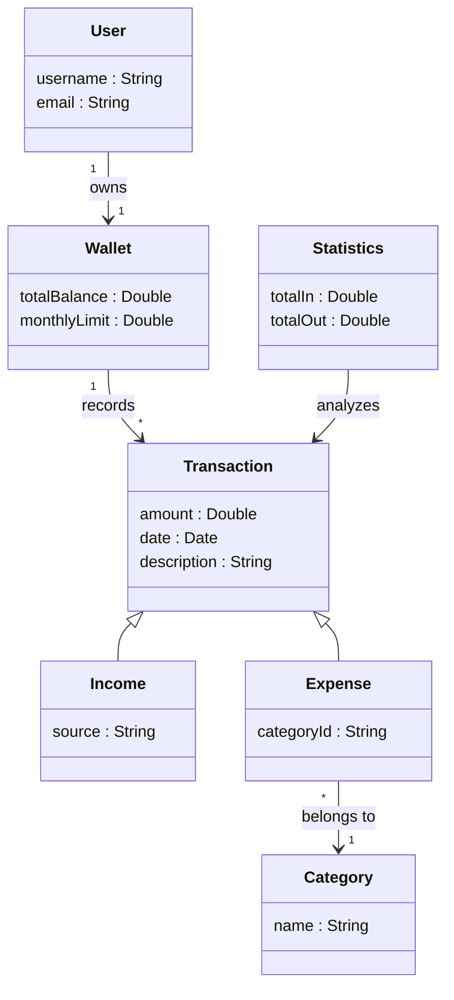
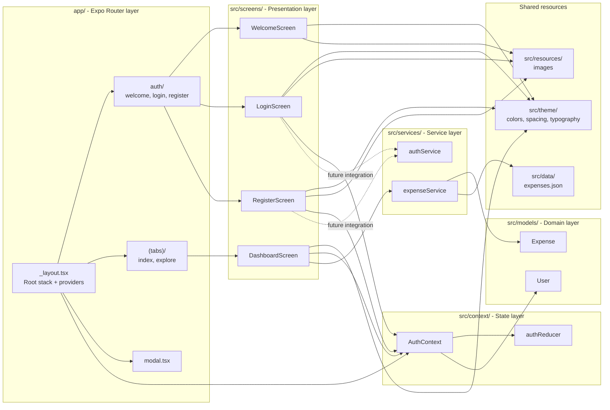

# pocketED Mermaid UML diagrams
*first revision / april 2026*

## Domain model

The following UML class diagram illustrates the key concepts and their relationships within pocketED:

## Logical architecture

The logical structure of the current implementation is organized into the following packages:

- `app/`: route entry points and layouts. The root layout defines the navigation stack and wraps the app with the authentication provider.
- `src/screens/`: screen-level UI implementations such as welcome, login, register and dashboard.
- `src/context/`: shared application state, currently centered on `AuthContext` and its reducer.
- `src/services/`: data access and business-facing operations, such as loading expenses from the local dataset.
- `src/models/`: typed domain entities like `User` and `Expense`.
- `src/theme/`: shared visual tokens, including colors, spacing, and typography.
- `src/data/` and `src/resources/`: bundled mock data and static media assets.

The dependency flow is intentionally one-directional: routes render screens, screens consume context and services, and services rely on models plus local data sources. This reduces coupling and keeps the UI replaceable without changing the lower layers.